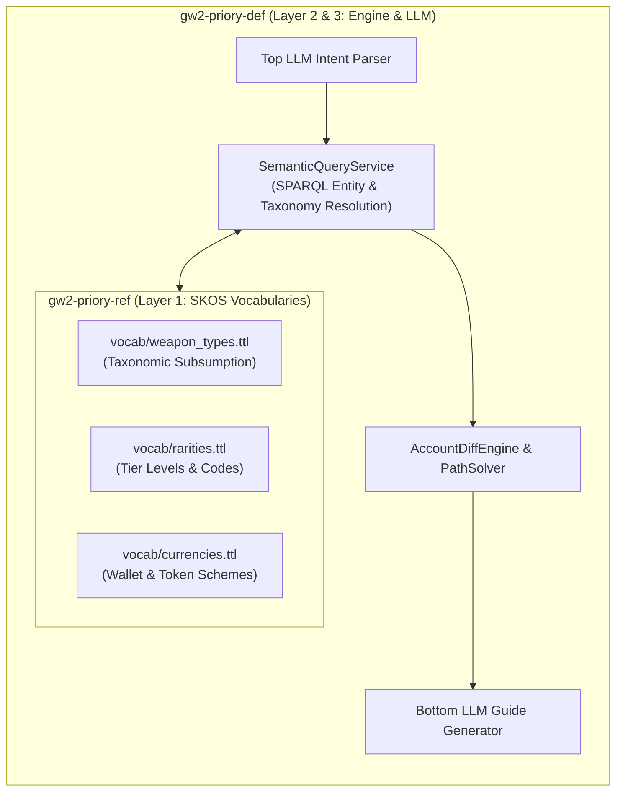

# GW2 Priory Reference Data (`gw2-priory-ref`)

Authoritative **W3C SKOS Controlled Vocabularies, Taxonomies, and Concept Schemes** for *Guild Wars 2* semantic tooling.

This repository serves as the single source of truth for classifications, stable URIs, and identity alignments across Project Priory.

---

## 📚 Vocabularies

| Vocabulary File | Concept Scheme | Namespace URI | Description |
| :--- | :--- | :--- | :--- |
| [`vocab/rarities.ttl`](./vocab/rarities.ttl) | `priory-ref:RarityScheme` | `https://priory.gw2/ref/rarity/` | Item rarities from Junk (0) to Legendary (7). |
| [`vocab/disciplines.ttl`](./vocab/disciplines.ttl) | `priory-ref:DisciplineScheme` | `https://priory.gw2/ref/discipline/` | 9 Crafting disciplines and max skill ratings. |
| [`vocab/weapon_types.ttl`](./vocab/weapon_types.ttl) | `priory-ref:WeaponTypeScheme` | `https://priory.gw2/ref/weapon/` | Weapon taxonomies (One-handed, Two-handed, Off-hand, Aquatic). |
| [`vocab/game_modes.ttl`](./vocab/game_modes.ttl) | `priory-ref:GameModeScheme` | `https://priory.gw2/ref/gamemode/` | Game activities (Open World, Fractals, Raids, WvW, PvP). |
| [`vocab/currencies.ttl`](./vocab/currencies.ttl) | `priory-ref:CurrencyScheme` | `https://priory.gw2/ref/currency/` | Wallet currencies, map currencies, and dungeon tokens. |

---

## 🔗 Namespaces & URI Patterns

* **Base Reference Namespace:** `@prefix priory-ref: <https://priory.gw2/ref/> .`
* **Schema Definition Namespace:** `@prefix priory: <https://priory.gw2/def/> .`
* **W3C SKOS:** `@prefix skos: <http://www.w3.org/2004/02/skos/core#> .`

---

## 🏛️ Integration with Project Priory Neuro-Symbolic Engine

The vocabularies in this repository serve as the semantic foundation for the **Neuro-Symbolic Sandwich** in [`gw2-priory-def`](https://github.com/cdcc-jpg/gw2-priory-def).

For the full technical reference and sequence diagrams, see:
* [📊 **Pipeline & Semantic Touchpoints Reference**](./docs/neuro_symbolic_architecture_and_pipeline.md)

