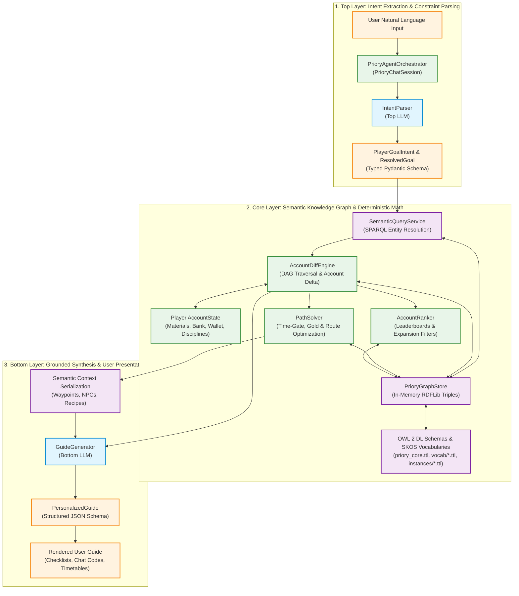
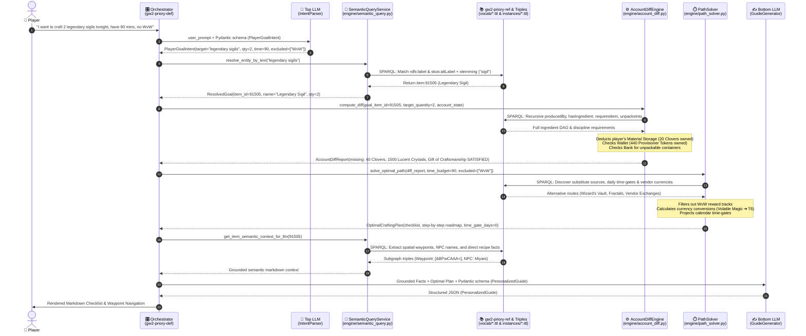
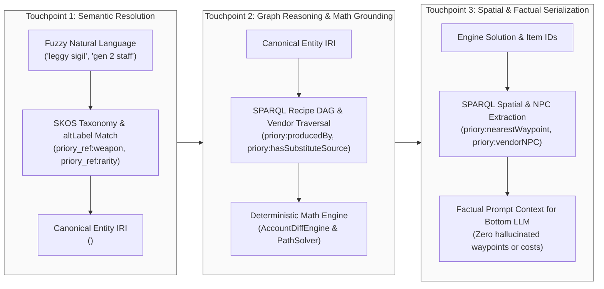

# Project Priory: Neuro-Symbolic Architecture & Pipeline Interaction Reference

This document provides a comprehensive technical breakdown and visual graphs illustrating the end-to-end data flow, component interactions, and the precise roles of the **Semantic Web Layer (OWL 2 DL, SKOS, RDFLib, SPARQL)** in Project Priory, focusing on how `gw2-priory-ref` controlled vocabularies and taxonomies interface with the reasoning engine.

---

## 1. High-Level Architecture Overview

Project Priory executes a **Neuro-Symbolic Sandwich** pattern that combines the natural language strengths of Large Language Models with the strict determinism and verifiable truth of Semantic Web technologies and mathematical graph algorithms.

---

## 2. End-to-End Sequence & Interaction Flow

---

## 3. The Three Touchpoints of the Semantic Web Layer

---

## 4. Role of `gw2-priory-ref` in the Architecture

The `gw2-priory-ref` repository provides the foundational **SKOS Controlled Vocabularies** (`vocab/*.ttl`) that empower:
1. **Taxonomic Subsumption**: Enables hierarchical query resolution (e.g. `weapon:TwoHandedWeapon` subsuming `weapon:Greatsword`, `weapon:Staff`, `weapon:Spear`).
2. **Controlled Property Domains/Ranges**: Standardized URIs for `rarity:`, `discipline:`, `currency:`, `gamemode:`, and `weapon:` schemes.
3. **Synonym Matching**: `skos:altLabel` triples provide domain-accurate naming aliases without hardcoding synonyms in Python code.
